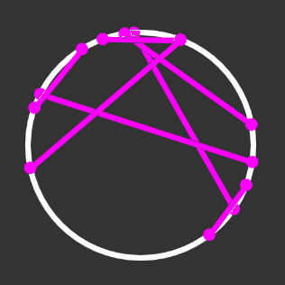

# Projects

<!---[Approximating the Average Length of a Chord in the Unit Circle](https://github.com/MilesMoran/Small-Projects/tree/master/Chord%20Length)
--->

[LaTeX Notes for Casella & Berger: Classical Inference](https://bookdown.org/moramile/Classical-Inference/)

